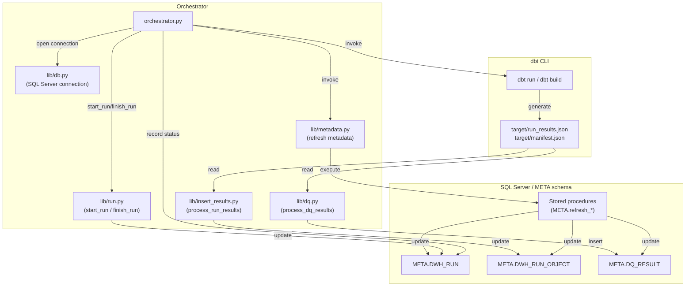

# BTC DWH Architecture

## Overview

This document describes the runtime architecture of the `btc_dwh` project.
The orchestrator script coordinates dbt execution, metadata refreshes, and result processing with a SQL Server backend.

## Components

- `scripts/orchestrator.py`
  - Main orchestration entrypoint.
  - Parses CLI arguments and manages a DBT run lifecycle.
  - Opens a SQL Server connection using `scripts/lib/db.py`.
  - Creates and finishes the run in metadata tables using `scripts/lib/run.py`.
  - Runs DBT commands and processes dbt artifacts.

- `dbt` CLI
  - Executes `dbt run` for load models.
  - Executes `dbt build` for build models.
  - Produces `target/run_results.json` and `target/manifest.json`.

- `scripts/lib/insert_results.py`
  - Parses `target/run_results.json`.
  - Updates `META.DWH_RUN_OBJECT` rows with object status, duration, and row counts.

- `scripts/lib/dq.py`
  - Parses dbt test results and manifest metadata.
  - Inserts data quality results into `META.DQ_RESULT`.

- `scripts/lib/metadata.py`
  - Invokes stored procedures in the `META` schema:
    - `META.refresh_source`
    - `META.refresh_source_profile_rule`
    - `META.refresh_dq_profile`
    - `META.refresh_load_statistics`

- `scripts/lib/db.py`
  - Provides SQL Server connection configuration.
  - Uses `pyodbc` and `DRIVER`, `SERVER`, `DATABASE` constants from `scripts/lib/config.py`.

## Data flow

## Execution sequence

1. `orchestrator.py` starts and opens a SQL Server connection.
2. `start_run` creates a run record in `META.DWH_RUN`.
3. `dbt run` executes load models with `--vars {run_id: ...}`.
4. `process_run_results` reads `target/run_results.json` and updates `META.DWH_RUN_OBJECT`.
5. `MetadataService` refreshes source metadata and profile rules.
6. `MetadataService.refresh_dq_profile` invokes DBT-driven data quality profile refresh.
7. `dbt build` executes build models.
8. `process_run_results` reads the newer `target/run_results.json` and updates `META.DWH_RUN_OBJECT` again.
9. `process_dq_results` reads `target/run_results.json` and `target/manifest.json` and inserts quality test results into `META.DQ_RESULT`.
10. `MetadataService.refresh_load_statistics` refreshes load metrics.
11. `finish_run` writes final run status back to `META.DWH_RUN`.

## Notes

- `dbt` is executed as an external subprocess.
- `orchestrator.py` logs stdout from dbt and provides a spinner for model execution.
- Errors during orchestration mark the run as `FAILED` in the metadata table.
